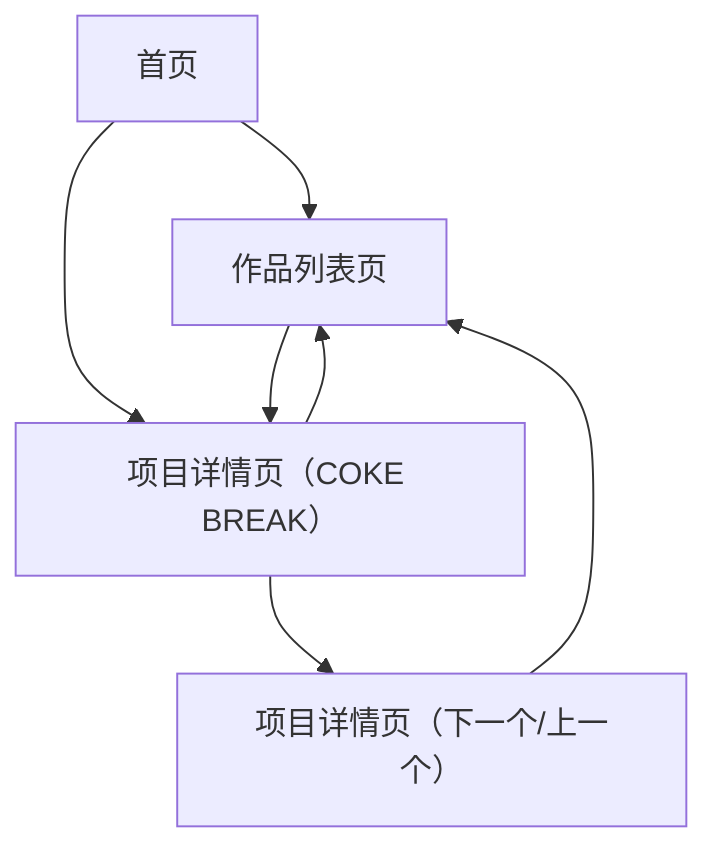

## 1. Product Overview

“COKE BREAK”项目详情页用于在作品集站点中，以编辑式排版展示单个项目的关键信息、主视觉与过程说明，并承接从首页/作品列表进入的浏览路径。

## 2. Core Features

### 2.1 Feature Module

作品集的核心页面如下：

1. **首页**：顶部导航、精选项目入口（含“COKE BREAK”卡片/链接）。
2. **作品列表页**：项目卡片列表、筛选/排序（如有）。
3. **项目详情页（COKE BREAK）**：返回入口、项目信息概览、主视觉媒体、分区内容说明、上下个项目导航。

### 2.2 Page Details

| Page Name         | Module Name | Feature description                           |
| ----------------- | ----------- | --------------------------------------------- |
| 首页                | 顶部导航复用      | 跳转到作品列表/关于/联系等；样式（字体/背景/间距）与全站一致              |
| 首页                | 项目入口        | 点击“COKE BREAK”进入详情页                           |
| 作品列表页             | 项目卡片        | 展示封面、标题、标签；点击进入对应详情页                          |
| 项目详情页（COKE BREAK） | 顶部导航复用      | 复用首页导航结构、字体与背景风格；当前页高亮（如首页已支持）                |
| 项目详情页（COKE BREAK） | 返回入口        | 从详情页返回到作品列表或首页（取决于入口策略）                       |
| 项目详情页（COKE BREAK） | Hero 信息区    | 展示项目标题、简短副标题/标签、1段摘要文案（与截图排版一致）               |
| 项目详情页（COKE BREAK） | 主视觉媒体区      | 展示 1 张主图（可替换为视频/轮播但默认单图）；支持点击放大查看（可选：新标签打开原图） |
| 项目详情页（COKE BREAK） | 项目信息列表      | 以列表/小卡形式展示：年份、角色、周期、工具、交付物等（字段以你的内容源为准）       |
| 项目详情页（COKE BREAK） | 内容分区        | 按区块展示“背景/挑战/方案/过程/结果”等（区块标题与正文排版按截图的列宽与间距）    |
| 项目详情页（COKE BREAK） | 底部导航        | 提供“上一个/下一个项目”与返回作品列表入口；复用全站 Footer（如首页已有）     |

## 3. Core Process

* 浏览者在首页或作品列表看到“COKE BREAK”卡片，点击进入项目详情页。

* 在详情页顶部先获取标题、摘要与主视觉；随后向下阅读项目信息与分区内容。

* 浏览者可通过底部“上一个/下一个项目”继续浏览，或点击返回入口回到列表/首页。

