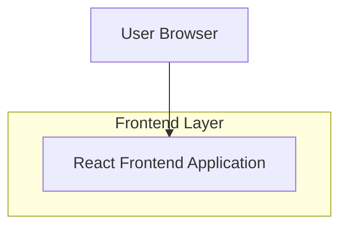

## 1.Architecture design


## 2.Technology Description
- Frontend: React@18 + vite + tailwindcss@3（用于快速实现截图中的版式与全站风格复用）
- Backend: None（静态作品集内容；如需后续接 CMS 再扩展）

## 3.Route definitions
| Route | Purpose |
|-------|---------|
| / | 首页（复用全站导航、背景、字体） |
| /work | 作品列表页（项目聚合入口） |
| /work/coke-break | “COKE BREAK”项目详情页（按截图布局展示） |

## 4.API definitions (If it includes backend services)
无（前端本地内容源即可）。

## 6.Data model(if applicable)
无数据库。建议在前端以内容配置驱动页面（便于复用组件与扩展更多项目）：

```ts
export type Project = {
  slug: string;
  title: string;
  subtitle?: string;
  tags?: string[];
  heroImage: { src: string; alt: string };
  facts: Array<{ label: string; value: string }>; // 年份/角色/工具等
  sections: Array<{ id: string; title: string; body: string }>; // 背景/挑战/方案...
  nextSlug?: string;
  prevSlug?: string;
};
```